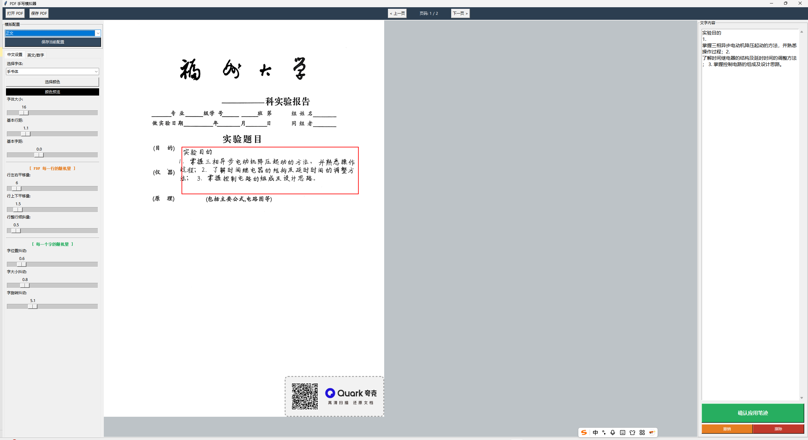
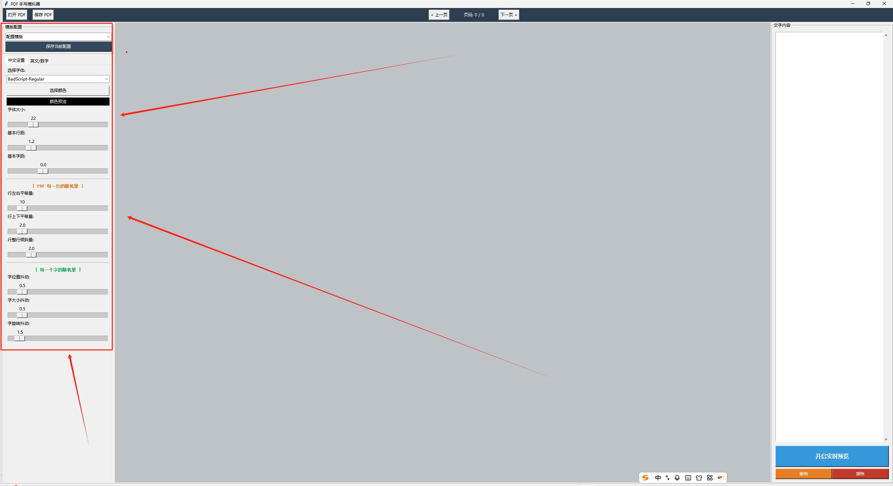
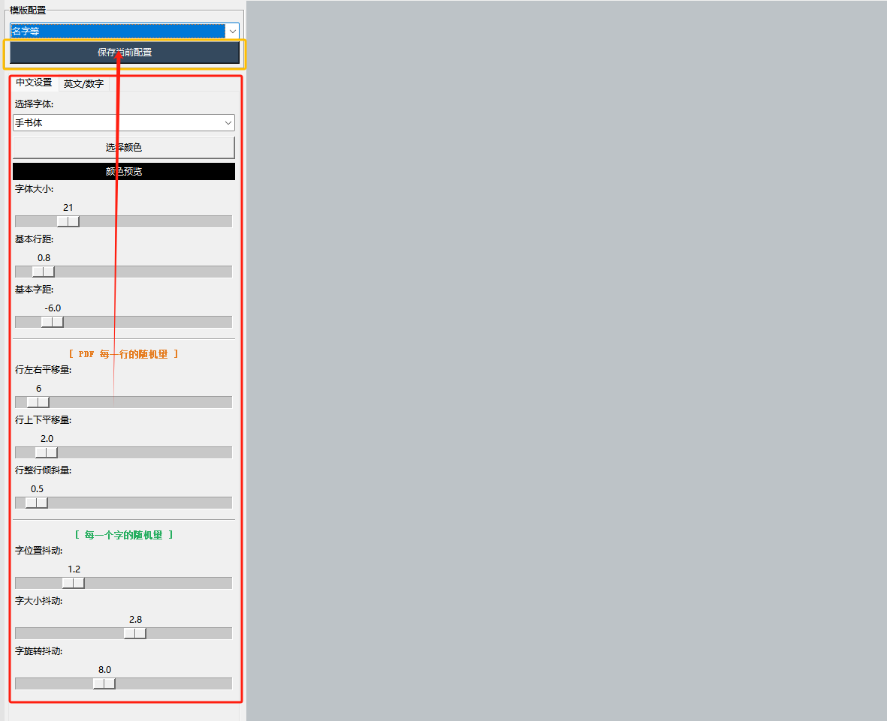
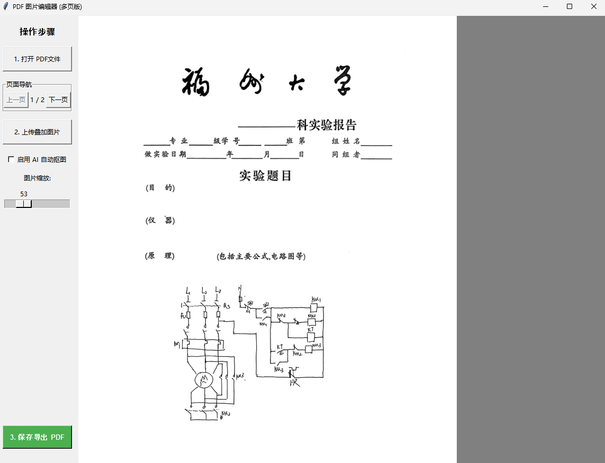

# PDF_Handwrite
## Project Overview
The PDF Handwriting Simulator is a desktop application developed based on the Python `tkinter` (graphical user interface framework) and `PyMuPDF` (PDF processing library). It is designed to simulate natural handwritten text effects on PDF files, supporting custom Chinese and English handwriting styles, random jitter parameters, and real-time preview functionality. It can meet the needs of scenarios requiring handwritten-style PDF output, such as simulating handwritten homework and notes. In addition, it allows inserting images into PDF files with free adjustment of their sizes and positions. After downloading the corresponding model, it also supports AI image matting for images before insertion.
 

### Core Features
1.  **Basic PDF Operations**: Supports opening existing PDF files, page switching (previous/next page), and saving the modified PDF to a specified path.
2.  **Rich Customizable Handwriting Settings**:
    - Custom font selection (supports TTF font files) and text color picking (default dark blue, freely adjustable).
    - Character-level jitter: Adjustable position, size, and rotation jitter of characters to simulate the irregularity of handwritten text.
    - Line-level jitter: Configurable left/right/up/down translation and overall line slanting of text lines to restore the line spacing and alignment effects of natural handwriting.
    - Basic typesetting: Adjustable font size, character spacing, and line spacing.
 
3.  **Template Management Functionality**: Save the current handwriting configuration as a JSON template for quick reuse; load saved template configurations via a drop-down box.
    
4.  **Interactive Operations**:
    - Real-time preview: Switch to preview mode to view handwriting effects without permanently modifying the PDF, and confirm application with one click.
    - Region selection: Drag the mouse on the PDF canvas to select the text insertion area (marked by a red rectangle).
    - Undo and Erase: Undo the last operation (up to 10 historical records saved), and erase text within the selected region (covered by white filling).
5.  **Image Insertion**:
    - Image insertion and adjustment: In `fig.py`, images can be inserted into the PDF, with flexible adjustment of their sizes and positions.
    - AI Image Matting: After downloading the `u2net.onnx` file and saving it in the `model` directory of the project, image matting can be performed on the image before insertion.
      

### Environment Dependencies
This project relies on the following Python libraries (tkinter is a built-in Python library and does not require additional installation):
1.  Pillow (for image processing and display)
2.  PyMuPDF (alias `fitz`, for PDF reading and editing)

#### Installation Command
Run the following command in the terminal to install the dependent libraries:
```bash
pip install pillow pymupdf
```

### Usage Steps
1.  **Running the Program**:
    - Save the code as a Python file (e.g., `pdf_handwriter.py`).
    - Run the file directly with Python: `python pdf_handwriter.py`.
    - After running, the program will automatically create the `TTF` and `SET` folders in the same directory as the script.
2.  **Preparing Font Files (Optional)**:
    - Place custom TTF font files (e.g., handwritten-style fonts) into the `TTF` folder, and the program will automatically scan and load these fonts.
    - If no custom fonts are provided, the program will use the system's `simkai.ttf` font by default.
3.  **Processing PDF Files**:
    - Click **"Open PDF"** to select the target PDF file to be edited.
    - On the PDF canvas, drag the mouse to draw a red rectangle (region selection) to specify the insertion position of the handwritten text.
    - Switch between the **"Chinese Settings"** and **"English/Numeric Settings"** tabs as needed to adjust handwriting parameters (font, color, jitter, etc.).
    - Enter the text content to be simulated as handwriting in the "Text Content" edit box on the right.
4.  **Previewing and Applying Effects**:
    - Click **"Enable Real-Time Preview"** to enter preview mode (the button text changes to "Confirm and Apply Handwriting"). The canvas will dynamically update the handwriting effect when adjusting parameters or editing text.
    - After confirming the effect is correct, click **"Confirm and Apply Handwriting"** to save the effect to the PDF (a success prompt will pop up).
5.  **Template and File Management**:
    - Click **"Save Current Configuration"** to save the current parameter settings as a JSON template (stored in the `SET` folder).
    - Select an existing template from the "Template Configuration" drop-down box to quickly apply the saved settings.
    - Use the **"Undo"** function to restore the previous state (up to 10 times), or use the **"Erase"** function to clear text within the selected region.
    - Click **"Save PDF"** to save the modified PDF to a specified path.

### Project Structure
```
├── pdf_handwriter.py  # Handwriting simulation core code
├── fig.py             # PDF image insertion code (supports AI matting)
├── model/             # Directory for storing the u2net.onnx file (for image matting)
├── TTF/               # Font folder (automatically created, for storing TTF font files)
└── SET/               # Template folder (automatically created, for storing JSON configuration files)
```

### Notes
1.  **Font Requirements**: Only TTF format fonts are supported. They need to be placed in the `TTF` folder before running the program, and the program will automatically scan and load them.
2.  **Preview Mode**: The PDF will not be permanently modified in preview mode; the effect will only be saved after clicking "Confirm and Apply Handwriting".
3.  **Undo Limitation**: The maximum number of undo records is 10 (modifiable via the `max_history` parameter in the code).
4.  **Region Limitation**: Text will not be displayed outside the red rectangular selection area. If text truncation occurs, please appropriately adjust the region size.
5.  **Encoding Support**: The program uses UTF-8 encoding to save templates, supporting Chinese template names.

---

# PDF 手写模拟器

## 项目概述
PDF 手写模拟器是一款基于 Python `tkinter`（图形界面框架）和 `PyMuPDF`（PDF 处理库）开发的桌面应用，用于在 PDF 文件上模拟自然的手写文字效果，支持自定义中英手写样式、随机抖动参数及实时预览功能，可满足模拟手写作业、笔记等需要手写风格 PDF 输出的场景需求。除此之外，还可以再pdf文件中插入图片并随心调整大小与位置，同时下载模型之后支持在插入的同时进行AI抠图。
 


### 核心功能
1.  **PDF 基础操作**: 支持打开现有 PDF 文件、页码切换（上一页/下一页），并可将修改后的 PDF 保存至指定路径。
2.  **丰富手写自定义**:
    - 自定义字体选择（支持 TTF 字体文件）和文字颜色拾取（默认深蓝色，可自由调整）。
    - 字符级抖动：可调节字符的位置、大小、旋转抖动，模拟手写文字的不规则性。
    - 行级抖动：可配置文本行的左右/上下平移及整行倾斜，还原自然手写的行间距与对齐效果。
    - 基础排版：可调字体大小、字间距、行间距。
 
1.  **模版管理功能**: 将当前手写配置保存为 JSON 模版，方便快速复用；可通过下拉框加载已保存的模版配置。
    
2.  **交互式操作**:
    - 实时预览：切换预览模式，无需永久修改 PDF 即可查看手写效果，一键确认应用。
    - 区域选择：在 PDF 画布上拖拽鼠标选择文本插入区域。
    - 撤销与擦除：撤销上一步操作（最多保存 10 条历史记录），擦除所选区域内的文字（白色填充覆盖）。
2.  **图片插入**:
    - 图片插入与调整：在fig.py里面，可以实现往pdf里面插入图片并调整大小与位置
    - AI抠图：u2net.onxx文件并保存在目录的model路径下之后可以实现插入之前对插入的图片进行抠图
      

### 环境依赖
本项目依赖以下 Python 库（tkinter 为 Python 内置库，无需额外安装）：
1.  Pillow（用于图片处理与显示）
2.  PyMuPDF（别名 `fitz`，用于 PDF 读取与编辑）

#### 安装命令
在终端中运行以下命令安装依赖库：
```bash
pip install pillow pymupdf
```

### 使用步骤
1.  **运行程序**:
    - 将代码保存为 Python 文件（如 `pdf_handwriter.py`）。
    - 直接使用 Python 运行该文件：`python pdf_handwriter.py`。
    - 运行后，程序会在脚本同级目录自动创建 `TTF` 和 `SET` 文件夹。
2.  **准备字体文件（可选）**:
    - 将自定义 TTF 字体文件（如手写风格字体）放入 `TTF` 文件夹，程序会自动扫描并加载这些字体。
    - 若未提供自定义字体，程序将默认使用系统 `simkai.ttf` 字体。
3.  **处理 PDF 文件**:
    - 点击 **"打开 PDF"**，选择需要编辑的目标 PDF 文件。
    - 在 PDF 画布上，拖拽鼠标绘制红色矩形（选择区域），指定手写文字的插入位置。
    - 根据需要切换 **"中文设置"** 和 **"英文/数字"** 标签页，调整手写参数（字体、颜色、抖动等）。
    - 在右侧「文字内容」编辑框中，输入需要模拟手写的文本内容。
4.  **预览与应用效果**:
    - 点击 **"开启实时预览"** 进入预览模式（按钮文字变为"确认应用笔迹"），调整参数或编辑文本时，画布会动态更新手写效果。
    - 确认效果无误后，点击 **"确认应用笔迹"**，将效果保存至 PDF（弹出成功提示）。
5.  **模版与文件管理**:
    - 点击 **"保存当前配置"**，可将当前参数设置保存为 JSON 模版（存储在 `SET` 文件夹中）。
    - 在「模版配置」下拉框中选择现有模版，可快速应用已保存的配置。
    - 使用 **"撤销"** 功能可恢复至上一状态（最多 10 次），或使用 **"擦除"** 功能清除所选区域内的文字。
    - 点击 **"保存 PDF"**，将修改后的 PDF 保存至指定路径。

### 项目结构
```
├── pdf_handwriter.py  # 手写字体模拟代码文件
├── fig.py             # PDF图片插入代码(支持AI抠图)
├── model/             # 存放抠图用的u2net.onnx文件
├── TTF/               # 字体文件夹（自动创建，存放 TTF 字体文件）
└── SET/               # 模版文件夹（自动创建，存放 JSON 配置文件）
```

### 注意事项
1.  **字体要求**: 仅支持 TTF 格式字体，需在运行程序前放入 `TTF` 文件夹，程序会自动扫描加载。
2.  **预览模式**: 预览模式下不会永久修改 PDF，仅在点击"确认应用笔迹"后才会保存效果。
3.  **撤销限制**: 最大撤销记录数为 10 条（可通过代码中的 `max_history` 参数修改）。
4.  **区域限制**: 文字不会显示在红色矩形选择区域之外，若出现文字截断，请适当调整区域大小。
5.  **编码支持**: 程序采用 UTF-8 编码保存模版，支持中文模版名称。